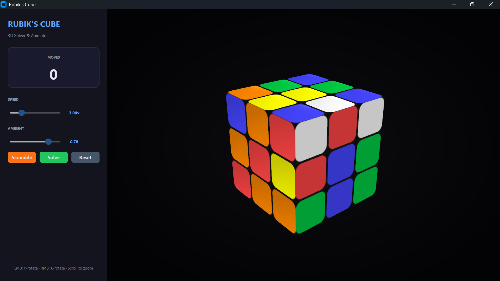

# Rublik Cube Solver 3D

<p align="center">
  
</p>

A real-time 3D Rubik's Cube solver and animator with a modern dark-themed GUI. Built entirely in Python — renders the cube using ModernGL (OpenGL 3.3), animates moves with smooth easing, and solves any scramble via the Kociemba two-phase algorithm.

## Purpose

This project exists as both an interactive toy and a teaching tool for anyone curious about how a Rubik's Cube works in code. It demonstrates:

- Representing cube state as a 27×6 matrix (27 cubies × 6 face colors)
- Simulating physical rotations by transforming cubie positions and remapping face normals
- Integrating a C-optimized solver (Kociemba) into a real-time Python application
- Embedding a lightweight OpenGL renderer inside a desktop GUI via CustomTkinter

## Features

- **3D rendered cube** — Beveled cubies with per-face colors, smooth lighting, and a dark gradient background
- **Move animation** — Stepped easing (smoothstep interpolation) between each move
- **Kociemba solver** — Finds optimal or near-optimal solutions (~20 moves) for any scramble
- **Scramble generator** — Random 20-move scramble with no consecutive same-face moves
- **Camera controls** — Left-drag to orbit yaw, right-drag to orbit pitch, scroll to zoom
- **Adjustable speed & ambiance** — Sliders for animation speed (1–10×) and ambient light level (0–1)

## Libraries Used

| Library | Purpose |
|---------|---------|
| [numpy](https://numpy.org/) | Cube state storage and matrix transformations |
| [moderngl](https://moderngl.readthedocs.io/) | OpenGL 3.3 rendering context and shader pipeline |
| [moderngl-window](https://github.com/moderngl/moderngl-window) | Window and input integration for ModernGL |
| [customtkinter](https://customtkinter.tomschimansky.com/) | Modern dark-themed desktop GUI (sidebar, buttons, sliders) |
| [pyopengltk](https://github.com/nicoddemus/pyopengltk) | Embeds an OpenGL framebuffer inside a Tkinter widget |
| [rubik-solver](https://github.com/Wiratama/rubik-solver) | Kociemba two-phase algorithm for solving the cube |
| [glfw](https://www.glfw.org/) | Native windowing and input (used by moderngl-window) |

## Algorithms Used

### Cube Representation
The cube is stored as a **27 × 6 numpy array** — one row per cubie, one column per face direction (+X, −X, +Y, −Y, +Z, −Z). Solved faces store their canonical color; internal faces are marked with a sentinel value (6).

### Rotation
When a face is rotated, all cubies on that layer have their positions transformed via a 90° or 180° rotation around the face axis. Each cubie's face normals are also rotated so that the colors move with the cubie — the sticker that was on the right face after a U move ends up on the back face, exactly like a physical cube.

### Move Encoding
18 standard moves (`U`, `U'`, `U2`, `D`, `D'`, ...) are mapped to an axis + layer + sign. Double moves are decomposed into two single moves for uniform handling.

### Solving
The solver converts the internal cube state into a 54-character string (`rubik_solver`'s NaiveCube format) and runs **Kociemba's two-phase algorithm**. The solution is returned as a list of move strings that the animator plays back step by step.

### Animation
Each move is animated with a **smoothstep (3t² − 2t³)** easing curve over a configurable duration (default ~300ms at 1× speed). Moves are queued and played sequentially.

### Camera
The camera orbits the cube using spherical coordinates (yaw, pitch). The view matrix is computed from the eye position, forward vector, and up vector — no `lookAt` helper, pure linear algebra.

## Requirements

- Python 3.10+
- A GPU with OpenGL 3.3 support (virtually any GPU made after ~2010)

## Installation

```bash
pip install -r requirements.txt
```

## Usage

```bash
python rubik.py
```

### Controls

| Input | Action |
|-------|--------|
| Left mouse drag | Orbit the camera around the Y axis |
| Right mouse drag | Orbit the camera around the X axis |
| Mouse wheel | Zoom in / out |

### Buttons

| Button | Action |
|--------|--------|
| **Scramble** | Generates 20 random moves and animates them |
| **Solve** | Solves the current cube state and animates the solution |
| **Reset** | Returns the cube to the solved state |

## Project Structure

```
rubik.py         — GUI application: sidebar layout, event handling, render loop
cube.py          — Core logic: CubeState, move application, solver wrapper, self-tests
requirements.txt — Python dependencies
```

## Running Tests

```bash
python cube.py
```

This runs a self-test that verifies move reversibility, double-move equivalence, randomize/unscramble round-trip, and solver correctness.
